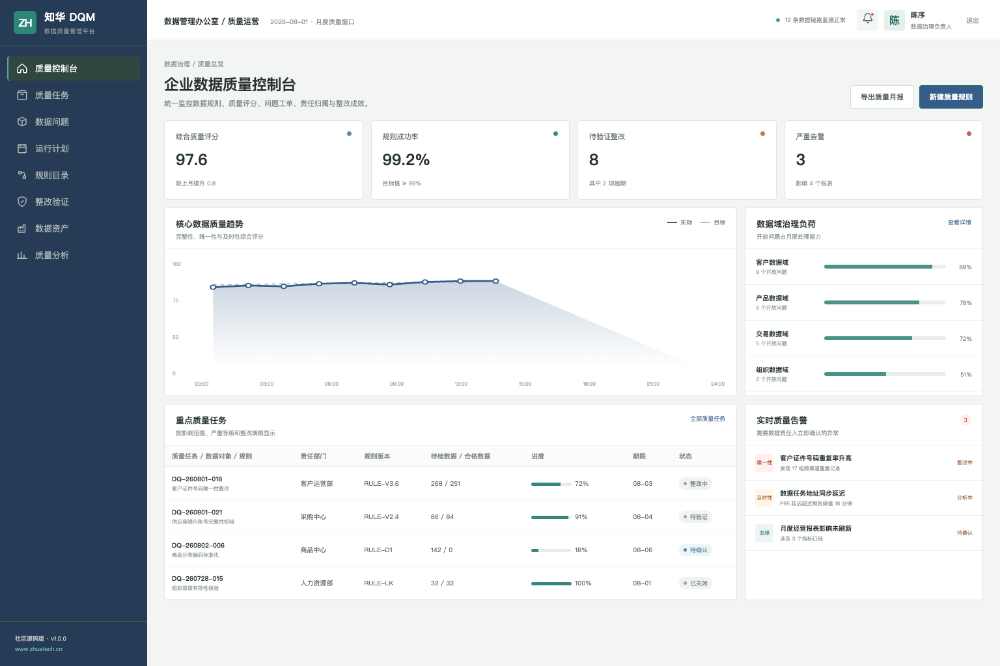
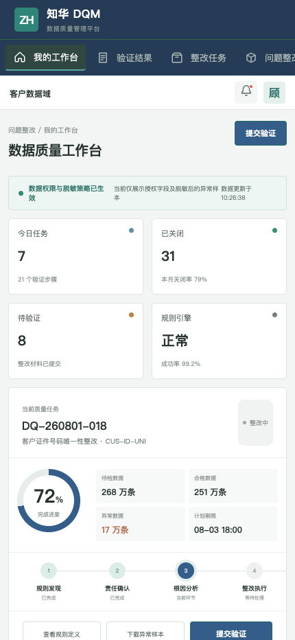

# 数据质量不是一次清洗，而是一套持续运行的责任机制

<div align="center">

## ZhuaTech DQM

知华科技数据质量管理平台社区源码版

[官方网站](https://www.zhuatech.cn/) · [技术架构](docs/architecture.md) · [API](docs/api.md) · [许可协议](LICENSE)

</div>

ZhuaTech DQM 由知华科技（上海如静知华信息科技有限公司）发布，用于演示企业如何围绕数据规则、问题发现、责任分派、根因整改和质量验证建立闭环。

## 质量运营控制台

面向数据管理办公室和数据治理负责人，展示质量评分、规则运行、数据域负荷、严重告警和整改进展。



## 数据质量专员工作台

H5 端围绕整改任务、异常样本、规则定义、验证结果和血缘影响组织现场工作。



## 可以用它学习什么

```text
数据资产
  └─ 质量规则（完整性 / 唯一性 / 一致性 / 准确性 / 及时性）
       └─ 规则执行与异常样本
            └─ 问题派发、根因分析和整改
                 └─ 验证关闭、评分更新和复发监控
```

- 数据域、数据责任人、质量规则与阈值管理
- 批量/实时规则调度、异常样本脱敏和影响分析
- 质量问题工单、SLA、根因、整改与验证闭环
- 质量评分、规则成功率、问题趋势和复发率分析
- JWT 权限、审计记录、Flyway 迁移和接口测试

页面中的指标、部门、人员和异常样本均为虚构内容。

## 快速启动

```bash
cd frontend
npm install
npm run dev:demo
```

访问 `http://localhost:5173`，使用管理端 `planner / Demo@2026` 或质量专员端 `operator / Demo@2026`。完整环境使用 `cp .env.example .env && docker compose up --build`。

技术栈：Java 21、Spring Boot、Spring Security、JPA、MySQL 8、Flyway、Vue 3、Pinia、Vite、Docker Compose。Java 根包 `cn.zhuatech.dqm`，数据库 `zhuatech_dqm`。

## 许可及联系

本工程仅供个人学习、研究和非商业交流，**禁止未经授权的商业使用**。企业生产部署、内部经营、SaaS、客户交付、品牌替换、收费培训、咨询实施和商业再分发，须取得上海如静知华信息科技有限公司书面授权，详见 [LICENSE](LICENSE)。

如需数据治理、数据质量平台、MDM/数据湖集成、私有化部署或深度定制，请访问[知华科技官网](https://www.zhuatech.cn/)并扫码沟通：

| 方案咨询 | 开发咨询 |
| --- | --- |
|  |  |

关键词：数据质量管理系统、DQM 源码、数据治理平台、数据质量规则、数据问题闭环、Java 数据治理、Vue 数据质量、知华科技。

## 数据集质量评分

`POST /api/admin/quality-score` 对完整性、准确性、一致性、及时性和关键规则失败进行加权评分，生成质量等级与整改清单。低于发布标准的数据集会明确返回阻断标记。

## 数据漂移检测

新增 `POST /api/dqm/insights/data-drift`，监控数据量、空值率、字段分布、结构变更和新鲜度偏离，输出 `STABLE`、`INVESTIGATE` 或 `BLOCK_PIPELINE`。

## 企业级数据产品发布

新增 `POST /api/enterprise/dqm/data-product-release`，覆盖数据契约、结构、血缘、质量、敏感分类和刷新 SLA，返回 `PUBLISH / REVIEW / BLOCKED`。详见 [数据产品发布说明](docs/ENTERPRISE_DATA_PRODUCT_RELEASE.md)。
